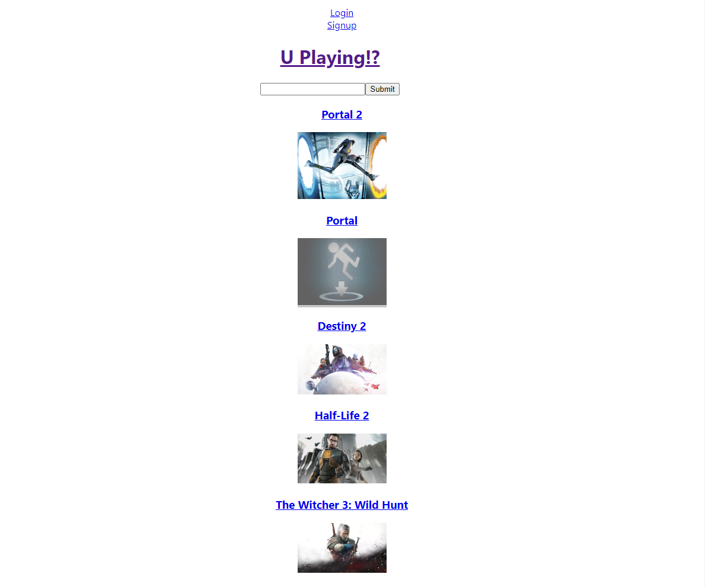
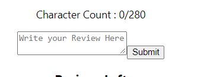
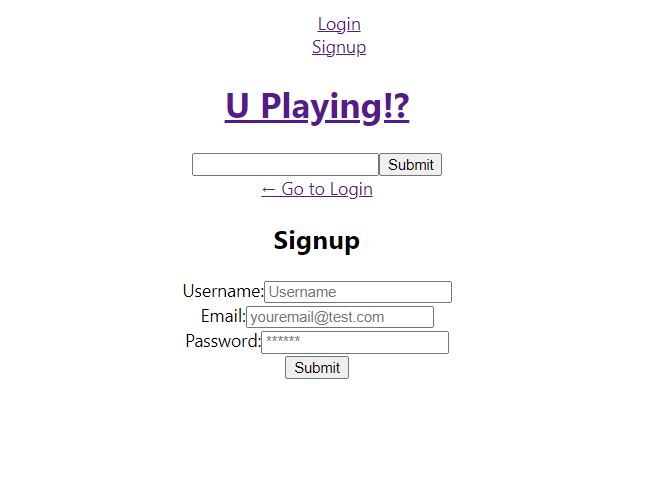

# U-Playing!?

## Table of Contents

* [Description](#description)
* [Installation](#installation)
* [Usage](#usage)
    * [With Search](#With-Search)
    * [Join In For Review](#Join-In-For-Review)
* [Reference](#references)
* [Credit](#credit)
* [License](#license)

## Description
As a game-a-holic, I want to share the experiences with my favorite games to many other game-a-holics, so that I create an app that satisfy my ideal.

U-Playing!? is a ready player one forum that gamers can search for theirs favorite games and share their experience, they can also looks for other games and read reviews from other gamers

## Installation
Pleas click the link to get the access to the app: [U-Playing!?](https://enigmatic-reaches-24986.herokuapp.com/).
If you want to install the application, follow the link to [Public Repository](https://github.com/LoiT1020/U-Playing).

## Usage
Gamers will knowleged different games each time they refresh the app, click on the game title, the app will provide some description and some information that is needed for the game.

Gamer can also read the game review form other gamers

Gamers can also read reviews from other gamers about the game you choose

### With Search
Some time when player want to know more about their favorite game, there is search feature so that gamers can search for their games

### Join In For Review
Gamer can join in the community and sharing their review about games they likes, at first they need to create new ID 

and log in into the app

[! login](./assets/images/log%20in.PNG)

Once they become member, they can make reviews for their games

## References

[Node.js](https://nodejs.org/api/path.html)

[Professional README Guide](https://coding-boot-camp.github.io/full-stack/github/professional-readme-guide)

[concurently](https://www.npmjs.com/package/concurrently)

[nodemon](https://www.npmjs.com/package/nodemon)

[apollo-server-express](https://www.npmjs.com/package/apollo-server-express)

[bcrypt](https://www.npmjs.com/package/bcrypt)

[Dotenv](https://www.npmjs.com/package/dotenv)

[express](https://www.npmjs.com/package/express)

[graphql](https://www.npmjs.com/package/graphql)

[jsonwebtoken](https://www.npmjs.com/package/jsonwebtoken)

[mongoose](https://www.npmjs.com/package/mongoose)

[node-fetch](https://www.npmjs.com/search?q=node-fetch)

[@apollo/client](https://www.npmjs.com/package/@apollo/client)

[jwt-decode](https://www.npmjs.com/package/jwt-decode)

[react](https://www.npmjs.com/package/jwt-decode)

[react-dom](https://www.npmjs.com/package/react-dom)

[react-router-dom](https://www.npmjs.com/package/react-router-dom)

## Collaborators
###  [Tran Loi], [Mitchel Eide], [Devon Gray]

## License
### MIT

#### Copyright (c) [2022] [Tran Loi], [Mitchel Eide], [Devon Gray]

##### Permission is hereby granted, free of charge, to any person obtaining a copy of this software and associated documentation files (the "Software"), to deal in the Software without restriction, including without limitation the rights to use, copy, modify, merge, publish, distribute, sublicense, and/or sell copies of the Software, and to permit persons to whom the Software is furnished to do so, subject to the following conditions:

##### The above copyright notice and this permission notice shall be included in all copies or substantial portions of the Software.

##### THE SOFTWARE IS PROVIDED "AS IS", WITHOUT WARRANTY OF ANY KIND, EXPRESS OR IMPLIED, INCLUDING BUT NOT LIMITED TO THE WARRANTIES OF MERCHANTABILITY, FITNESS FOR A PARTICULAR PURPOSE AND NONINFRINGEMENT. IN NO EVENT SHALL THE AUTHORS OR COPYRIGHT HOLDERS BE LIABLE FOR ANY CLAIM, DAMAGES OR OTHER LIABILITY, WHETHER IN AN ACTION OF CONTRACT, TORT OR OTHERWISE, ARISING FROM, OUT OF OR IN CONNECTION WITH THE SOFTWARE OR THE USE OR OTHER DEALINGS IN THE SOFTWARE.

[Tran Loi]:https://github.com/LoiT1020
[Mitchel Eide]:https://github.com/mitchmneide
[Devon Gray]:https://github.com/LoiT1020

